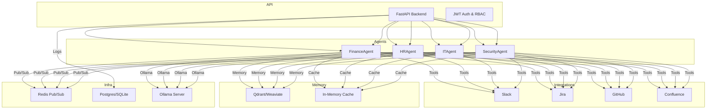

<div align="center">
	<h1>Corelia — Enterprise AI Orchestrator</h1>
	<a href="https://github.com/UnexpectedNull/Corelia"></a>
	<a href="https://github.com/UnexpectedNull/Corelia"></a>
	<a href="https://github.com/UnexpectedNull/Corelia"></a>
	<br>
	<a href="https://github.com/UnexpectedNull/Corelia">🌐 GitHub Repo</a>
</div>


<p align="center">
	
	
	
	
</p>

## Overview
<b>Corelia</b> is an enterprise backend orchestrator for AI agents (Finance, HR, IT, Security), each wrapping a local transformer model (Ollama/llama.cpp). Agents collaborate via a message bus, store context in a vector DB, and execute configurable workflows. Includes secure authentication, agent APIs, workflow runner, enterprise integrations, and usage examples.

## 📚 [Documentation](docs/README.md)

<p align="center">
	<a href="docs/README.md"></a>
</p>

## 🗺️ Architecture Diagram

- **Agent Communication**: Redis pub/sub
- **Memory**: Qdrant/Weaviate + in-memory cache
- **Workflows**: YAML/JSON runner
- **Integrations**: Slack, Jira, GitHub, Confluence
- **Persistence**: PostgreSQL/SQLite logs

---

## 🚀 Quickstart

### 1. Clone & Install
```bash
git clone https://github.com/UnexpectedNull/Corelia.git
cd Corelia
python3 -m venv venv
source venv/bin/activate
pip install -r requirements.txt
```


### 2. Configure
Edit `.env` for Ollama, DB, Redis, Qdrant, and OpenLlori keys:

```
OLLAMA_SERVER_URL=http://localhost:11434
API_KEYS=yourkey1,yourkey2
PORT=8000
RATE_LIMIT=60
```

### 3. Start Services
```bash
docker-compose up -d
```

### 4. Run API
```bash
uvicorn main:app --host 0.0.0.0 --port 8000 --reload
```

### 5. Try Examples
```bash
cd examples
python query_agent.py
python run_workflow.py
```

---

## ⚡ OpenLlori Quickstart

Install dependencies:
```bash
pip install -r requirements.txt
```

Configure `.env`:
```
OLLAMA_SERVER_URL=http://localhost:11434
API_KEYS=yourkey1,yourkey2
PORT=8000
RATE_LIMIT=60
```

Start the server:
```bash
uvicorn main:app --host 0.0.0.0 --port 8000 --reload
```

Call the API (Python example):
```python
import openai
openai.api_key = "yourkey1"
openai.api_base = "http://localhost:8000/v1"
response = openai.ChatCompletion.create(
	model="llama3",
	messages=[{"role": "user", "content": "Hello!"}]
)
print(response)
```

---

## 🗂️ Project Structure
```
main.py                # FastAPI entrypoint, routes
auth.py                # JWT + role-based access
agents/                # Agent logic (base + specializations)
workflows/             # Workflow runner + YAMLs
integrations/          # Slack, Jira, GitHub, Confluence
memory/                # Vector DB + cache
bus.py                 # Redis pub/sub
config.py              # Env loader
db.py                  # Logging (Postgres/SQLite)
requirements.txt       # Backend deps
docker-compose.yml     # Redis, Postgres, Qdrant
examples/              # Usage scripts
```

---

## 📝 Notes
- Agents use real Ollama and API integrations. Configure `.env` for all service tokens and endpoints.
- For production, use PostgreSQL and secure secrets.
- Extend workflows and integrations as needed.
