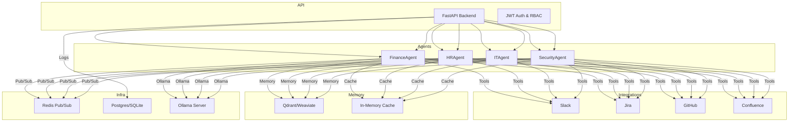

	<h1>Corelia Architecture Overview</h1>
	
	
	
	

Corelia is an enterprise AI orchestrator backend that manages multiple specialized AI agents, each wrapping a local transformer model (Ollama/llama.cpp). Agents collaborate via a message bus, store context in a vector database, and execute configurable workflows. The backend provides secure authentication, agent APIs, workflow execution, integrations, and logging.

## Architecture Diagram

- **Integrations**: Slack, Jira, GitHub, Confluence connectors.
- **Persistence**: PostgreSQL/SQLite for logs and activity.
- **API**: FastAPI-based, JWT authentication, RBAC.

See subfolders for details on each component.